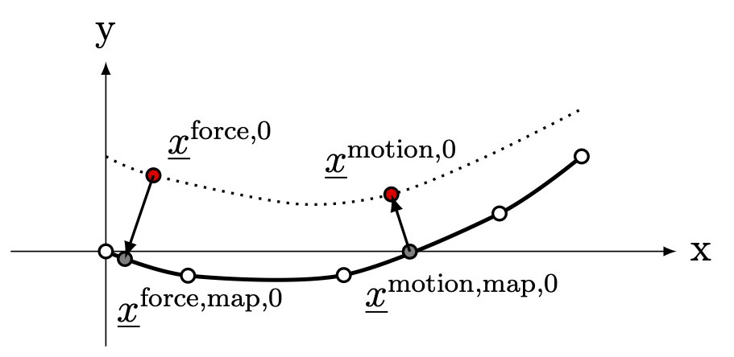

.. _`sec:fsi-api`:

Coupling for fluid-structure-interaction
----------------------------------------

Overview
~~~~~~~~

OpenTurbine was designed as a flexible multibody dynamics solver to be
coupled with external modules for fluid forcing at various
fluid-dynamics-model fidelity levels. At the lowest level, OpenTurbine
is coupled to a blade-element or blade-element-momentum-theory (BEMT)
solver like AeroDyn. At mid-fidelity, OpenTurbine is coupled to a CFD
solver, such as AMR-Wind, wherein blades are represented in the fluid as
actuator lines and forces are calculated through BE/BEMT. At the highest
fidelity, OpenTurbine is directly coupled to a geometry-resolved fluid
mesh in a solver like Nalu-Wind.

In all of these coupling approaches, the common thread is that forces
and moments are passed to OpenTurbine and OpenTurbine provides position
and velocity of the structure. For the preliminary development of
OpenTurbine and the coupling API, we assume that the fluid solver will
provide **point** force and moments that are appropriately distributed
to the nodes in a manner consistent with the beam basis functions.

In the following we describe the fluid-structure coupling between a
single **structural member** of OpenTurbine and a corresponding fluid model. As
discussed above, a member could be a beam, rigid body, or a massless
6-DOF point. Each member can be mapped to one or more fluid models. For
example, in a geometry-resolved CFD model, the CFD domain surrounding a
beam will often be decomposed for parallel computation, each domain tied
to a computational MPI rank.  

.. _`sec:fsi-init`:

Data initialization and transfer between solvers
~~~~~~~~~~~~~~~~~~~~~~~~~~~~~~~~~~~~~~~~~~~~~~~~

We focus on coupling between a member with :math:`P` nodes, where
:math:`P=1` for body represented by a point, e.g. a rigid body or a
massless 6-DOF node, and a fluid model whose motion is tied to structure
motion. The interface should be such that only the following nodal data
(for :math:`P` nodes) is transferred after initialization:

.. math::
   \underline{f}_i^n \in \mathbb{R}^3, \,
   \underline{m}_i^n \in \mathbb{R}^3, \,
   \underline{q}_i^n \in \mathbb{R}^7,\,
   \underline{v}_i^n \in \mathbb{R}^6, \qquad i\in \{1,\ldots,P\}
   :label: fsi-data

where the :math:`n` superscript denotes time station (:math:`t = t^{n-1} + \Delta t^n`)

.. math::

   \begin{aligned}
   \underline{q}_i^n = 
   \begin{bmatrix} \underline{u}_i^n \\
   \widehat{q}^n_i
   \end{bmatrix} \qquad
   \underline{v}^n_i = 
   \begin{bmatrix} \dot{\underline{u}}^n_i  \\
   \underline{\omega}^n_i
   \end{bmatrix} 
   \end{aligned}

and where :math:`\underline{u}_i^n \in \mathbb{R}^3` is displacement,
:math:`\widehat{q}_i^n \in \mathbb{R}^4` is relative rotation in
quaternions, and :math:`\underline{\omega}_i^n \in \mathbb{R}^3` is
angular velocity. In this approach, either within the fluid solver or
within an interface layer, the following data must be calculated at
initialization and be accessible to the fluid solver or interface layer:

- :math:`\underline{x}^\mathrm{r}_\ell \in\mathbb{R}^3\,,\, \widehat{q}^\mathrm{r}_\ell \in\mathbb{R}^4\,,\ell \in \{1, \ldots, P\}`,
  structure nodal locations and orientations (quaternions) in reference
  configuration

- :math:`n^\mathrm{motion}` and :math:`n^\mathrm{force}`, which are the
  number of fluid nodes tied to structure motion and forcing,
  respectively. For BE/BEMT,
  :math:`n^\mathrm{motion} = n^\mathrm{force}`.

- :math:`\underline{x}^{\mathrm{motion},\mathrm{r}}_j\in\mathbb{R}^3\,,\, j \in \{1, \ldots, n^\mathrm{motion}\}`,
  fluid nodal locations in reference configuration (user provided; or
  calculated based on aerodynamic section data for BE/BEMT)

- :math:`\underline{x}^{\mathrm{force},\mathrm{r}}_j\in\mathbb{R}^3\,,\, j \in \{1, \ldots, n^\mathrm{force}\}`,
  fluid nodal locations in reference configuration (user provided; or
  calculated based on aerodynamic section data for BE/BEMT)

- :math:`\xi^{\mathrm{motion},\mathrm{map}}_j\in[-1,1]\,,\, j \in \{1, \ldots, n^\mathrm{motion}\}`
  nearest location on the beam reference line for
  :math:`\underline{x}^{\mathrm{motion},\mathrm{r}}_j`; provided by user for
  BE/BEMT, but must be calculated at initialization for CFD coupling

- :math:`\xi^{\mathrm{force},\mathrm{map}}_j\in[-1,1]\,,\, j \in \{1, \ldots, n^\mathrm{force}\}`
  nearest location on the beam reference line for
  :math:`\underline{x}^{\mathrm{force},\mathrm{r}}_j`; provided by user for
  BE/BEMT, but must be calculated at initialization for CFD coupling

- :math:`\phi_\ell\left( \xi^{\mathrm{force},\mathrm{map}}_j\right)\,,\,
  \, \ell \in \{1, \ldots, P \},\,
  \, j \in \{1, \ldots, n^\mathrm{force} \}`, basis functions evaluated
  at the mapped nearest-neighbor location for each of the fluid nodes
  providing a force/moment value

- :math:`\phi_\ell \left(\xi^{\mathrm{motion},\mathrm{map}}_j\right)\,,
  \, \ell \in \{1, \ldots, P \}, 
  \, j \in \{1, \ldots, n^\mathrm{motion} \}`

- :math:`\underline{x}_j^{\mathrm{force},\mathrm{map},\mathrm{r}}\in\mathbb{R}^3`
  and
  :math:`\widehat{q}_j^{\mathrm{force},\mathrm{map},\mathrm{r}}\in\mathbb{R}^4`,
  :math:`j \in \{1,\ldots,n^\mathrm{force}\}`; calculated at
  initialization

- :math:`\underline{x}_j^{\mathrm{motion},\mathrm{map},\mathrm{r}}\in\mathbb{R}^3`
  and
  :math:`\widehat{q}_j^{\mathrm{motion},\mathrm{map},\mathrm{r}}\in\mathbb{R}^4`,
  :math:`j \in \{1,\ldots,n^\mathrm{motion}\}` ; calculated at
  initialization

- :math:`\underline{x}_j^{\mathrm{force-con}}\in\mathbb{R}^3,\, j \in \{1,\ldots,n^\mathrm{force}\}`,
  reference vectors between force-providing fluid nodes and nearest
  neighbor on the element; calculated at initialization

- :math:`\underline{x}_j^{\mathrm{motion-con}}\in\mathbb{R}^3,\, j \in \{1,\ldots,n^\mathrm{motion}\}`,
  reference vectors between fluid nodes whose motion is driven by the
  structure and nearest neighbor on the structure element; calculated at
  initialization

Note that while this formulation is generalized for a single beam
element with :math:`P` nodes, it can be applied to a single-DOF rigid
body, in which case :math:`P=1`, or expanded to multiple beam elements.

.. _`sec:fsi-map`:

Fluid-structure spatial mapping
~~~~~~~~~~~~~~~~~~~~~~~~~~~~~~~

This section describes the mapping between fluid and structure points, which must be done as part of initialization.  The formulation assumes that the fluid and structure are defined in the same global reference frame. 

We have set of :math:`n^\mathrm{force}` points in the fluid domain that
provide point forces/moments to the structure, and a set of
:math:`n^\mathrm{motion}` points in the fluid domain whose motion is
defined by the structure. For BE/BEMT coupling, typically
:math:`n^\mathrm{force}=n^\mathrm{motion}` and
:math:`\xi^{\mathrm{force},\mathrm{map}}_j = \xi^{\mathrm{motion},\mathrm{map}}_j`
and their definition is given as an input. For more general CFD
coupling, typically :math:`n^\mathrm{force} \ll n^\mathrm{motion}`. Each
of these force and motion fluid points must be mapped and tied to a
unique location on its associated structural member,
:math:`\underline{x}_j^{\mathrm{force,map},\mathrm{r}}` and
:math:`\underline{x}_j^{\mathrm{motion,map},\mathrm{r}}`, respectively.
For a point member,
:math:`\underline{x}_j^{\mathrm{force,map},\mathrm{r}} = \underline{x}_j^\mathrm{r}`
and
:math:`\underline{x}_j^{\mathrm{motion,map},\mathrm{r}}=\underline{x}_j^\mathrm{r}`.

For a beam member coupled to geometry-resolved CFD, our coupling is
based on minimum distance to the the finite-element represenation of the
beam reference line. To that end, we find
:math:`\xi^{\mathrm{force},\mathrm{map}}_l \in [-1,1]` such that the
distance squared,

.. math::

   \begin{aligned}
   d_i^2 = \left(\underline{x}^{\mathrm{force},\mathrm{r}}_i 
   - \sum_{\ell=1}^P \phi_\ell(\xi) \underline{x}^\mathrm{r}_\ell\right)^2
   \end{aligned}

is minimized for all :math:`i \in \{1, \ldots, n^\mathrm{force} \}` and
find :math:`\xi^{\mathrm{motion},\mathrm{map}}_j \in [-1,1]`, such that
the distance squared,

.. math::

   \begin{aligned}
   d_j^2 = \left(\underline{x}^{\mathrm{motion},\mathrm{r}}_j 
   - \sum_{\ell=1}^P \phi_\ell(\xi) \underline{x}_\ell^\mathrm{r}\right)^2
   \end{aligned}

is minimized for all :math:`j \in \{1, \ldots, n^\mathrm{motion} \}`.
**The Jenkins–Traub algorithm, RPOLY, should be considered for these
root solving problems.** The locations of those mapped reference points
in the inertial coordinate system are given by

.. math::

   \begin{aligned}
   \underline{x}^{\mathrm{force},\mathrm{map},\mathrm{\mathrm{r}}}_i = 
   \sum_{\ell=1}^{P} \phi_\ell(\xi^{\mathrm{force},\mathrm{map}}_i) \underline{x}^\mathrm{r}_\ell, \qquad i \in \{ 1, \ldots, n^\mathrm{force} \}
   \end{aligned}

.. math::

   \begin{aligned}
   \underline{x}^{\mathrm{motion},\mathrm{map},\mathrm{r}}_j = 
   \sum_{\ell=1}^{P} \phi_\ell(\xi^{\mathrm{motion},\mathrm{map}}_j) \underline{x}^\mathrm{r}_\ell, \qquad j \in \{ 1, \ldots, n^\mathrm{motion} \}
   \end{aligned}

.. math::

   \begin{aligned}
   \widehat{q}^{\mathrm{force,map,\mathrm{r}}}_i &= \frac{ \sum_{\ell=1}^{P} \phi_\ell\left(\xi_i^{\mathrm{force,map}} \right) \widehat{q}^\mathrm{r}_\ell}
   {\left \Vert \sum_{\ell=1}^{P} \phi_\ell\left(\xi_i^\mathrm{force,map} \right) \widehat{q}^\mathrm{r}_\ell \right \Vert} \\
   \widehat{q}^{\mathrm{motion,map,r}}_j &= \frac{ \sum_{\ell=1}^{P} \phi_\ell\left(\xi_j^{\mathrm{motion,map}} \right) \widehat{q}^\mathrm{r}_\ell}
   {\left \Vert \sum_{\ell=1}^{P} \phi_\ell\left(\xi_j^\mathrm{motion,map} \right) \widehat{q}^\mathrm{r}_\ell \right \Vert} 
   \end{aligned}

where :math:`P` is the number of nodes in the structural element, and
:math:`\underline{x}^\mathrm{r}_\ell` and
:math:`\widehat{q}^\mathrm{r}_\ell`\ are the reference locations and orientations
(represented as quaternions), respectively of the structural nodes in
the inertial coordinate system. For a beam coupled to a BE/BEMT solver,
:math:`\xi_j^\mathrm{motion,map} = \xi_j^\mathrm{force,map}` and those
are provided by the user. The vectors connecting these points are given
by

.. math::
   \begin{aligned}
   \underline{x}^\mathrm{force-con}_i &= -\underline{x}^{\mathrm{force},\mathrm{r}}_i + \underline{x}_i^{\mathrm{force},\mathrm{map}\mathrm{r}},  \qquad i \in \{ 1, \ldots, n^\mathrm{force} \} \\
   \underline{x}^\mathrm{motion-con}_j &= \underline{x}_j^{\mathrm{motion},\mathrm{r}} - \underline{x}^{\mathrm{motion},\mathrm{map},\mathrm{r}}_j, \qquad j \in \{ 1, \ldots, n^\mathrm{motion} \}
   \end{aligned}

   Schematic of mapping between a 5-node beam element and fluid force-transfer and motion-transfer nodes.

.. _sec-fsi-time:

Coupling in time
~~~~~~~~~~~~~~~~

An OpenTurbine goal is to provide an API mhat facilitates robust and accurate coupling with fluid-dynamics codes, like those in the ExaWind suite. OpenTurbine needs to provide data to the fluid solver at the "right" time. In our approach, we assume that OpenTurbine and the fluid solver are operating on a shared timeline.  However, the structural time integration scheme is typically different than that of the fluid solver, and the codes may be using different time step sizes.  For example, accuracy or stability requirements may require :math:`\Delta t^\mathrm{structure} < \Delta t^\mathrm{fluid}`, or vice versa.  In the following, :math:`\Delta t^{n+1}` is the FSI timestep for data sharing between codes such that :math:`t^{n+1} = t^{n} + \Delta t^{n+1}`, and we require that either :math:`\Delta t^\mathrm{fluid} = A \Delta t^\mathrm{structure}`  
:math:`A\ge 1` is a positive integer, and :math:`\Delta t^{n+1}` is taken equal to :math:`\Delta t^\mathrm{fluid}`.

Depending on the fluid solver, OpenTurbine output may be required at :math:`t^n` (e.g., fluid solver is explicit), :math:`t^{n+1/2}` (e.g., fluid solver is Crank-Nicolson), or :math:`t^{n+1}` (e.g., fluid solver is backwards Euler). For example, the Nalu-Wind CFD code uses a backwards Euler time integration scheme and AMR-Wind uses a Crank-Nicolson-like solver.  

Assume we know the following states at time :math:`t^n`, which are the data being transferred between the fluid and structure (see Eq. :eq:`fsi-data`):

.. math::

   \begin{aligned}
   \underline{f}_i^{n-1} \in \mathbb{R}^3, \,
   \underline{m}_i^{n-1} \in \mathbb{R}^3, \,
   \underline{q}_i^{n-1} \in \mathbb{R}^7,\,
   \underline{v}_i^{n-1} \in \mathbb{R}^6, \qquad i\in \{1,\ldots,P\}
   \end{aligned}

.. math::

   \begin{aligned}
   \underline{f}_i^n \in \mathbb{R}^3, \,
   \underline{m}_i^n \in \mathbb{R}^3, \,
   \underline{q}_i^n \in \mathbb{R}^7,\,
   \underline{v}_i^n \in \mathbb{R}^6, \qquad i\in \{1,\ldots,P\}
   \end{aligned}

The following describes the order of operations for the OpenTurbine FSI API.  It is "serial" in that the fluid and structure solvers are updated in serial.

Step 1: Predict/extrapolate the nodal fluid forces at
:math:`t^{n+1} = t^n + \Delta t^{n+1}`

.. math::

   \begin{aligned}
   \underline{f}_i^{n+1} \approx \underline{f}_i^{n} 
   + \frac{\Delta t^{n+1}}{\Delta t^n} \left( \underline{f}^{n}_i - \underline{f}^{n-1}_i \right)\\
   \underline{m}_i^{n+1} \approx \underline{m}_i^{n} 
   + \frac{\Delta t^{n+1}}{\Delta t^n} \left( \underline{m}^{n}_i - \underline{m}^{n-1}_i \right)
   \end{aligned}

Step 2: Advance the OpenTurbine solution to
:math:`t^{n+1} = t^n + \Delta t^{n+1}`, using forces
predicted/solved at :math:`t^{n+1}`. In the case that the structure uses
substeps, use force values linearly interpolated between those at :math:`t^{n+1}` and :math:`t^n`.

Step 3: Based on the nodal values at :math:`t^{n+1}`, calculate the associated motions of the fluid nodes at :math:`t^{n+1}`.  See :ref:`sec:fsi-motion`.

Step 4: Advance the fluid solver based on motion calculated by the
structural solver in Step 2.

Step 5: Update the fluid forces at nodes following :ref:`sec:fsi-force`.

Step 6: Either accept completion of time advance, or go back to Step 2
and repeat with latest fluid forces from Step 3. Note that one might to choose to only recalculate the structure solve, but that would potentially create a discrepancy between fluid and structure locations at :math:`t^{n+1}.

.. _`sec:fsi-motion`:

Motion transfer: Structure to fluid nodes
~~~~~~~~~~~~~~~~~~~~~~~~~~~~~~~~~~~~~~~~~

As the first step, generalized displacements and velocities are
calculated at the mapped locations on the structure:

.. math::

   \begin{aligned}
   \underline{q}_j^{\mathrm{motion},\mathrm{map}} = 
   \begin{bmatrix} \underline{u}_j^{\mathrm{motion},\mathrm{map}} \\
   \widehat{q}_j^{\mathrm{motion},\mathrm{map}}
   \end{bmatrix} \qquad
   \underline{q}_j^{\mathrm{motion},\mathrm{map}}
   \begin{bmatrix} \underline{\dot{u}}_j^{\mathrm{motion},\mathrm{map}} \\
   \underline{\omega}_j^{\mathrm{motion},\mathrm{map}}
   \end{bmatrix}, 
   \qquad j \in \{ 1, \ldots, n^\mathrm{motion} \}
   \end{aligned}

where

.. math::

   \begin{aligned}
   \underline{u}_j^{\mathrm{motion},\mathrm{map}} = \sum_{\ell=1}^P \phi_\ell \left(\xi_j^{\mathrm{motion},\mathrm{map}} \right) \underline{u}_\ell \\
   \widehat{q}^{\mathrm{motion},\mathrm{map}}_j = \frac{ \sum_{\ell=1}^{P} \phi_\ell\left(\xi_j^{\mathrm{motion},\mathrm{map}} \right) \widehat{q}_\ell} 
   {|| \sum_{\ell=1}^{P} \phi_\ell\left(\xi_j^{\mathrm{motion},\mathrm{map}} \right) \widehat{q}_\ell ||} \\
   \underline{\dot{q}}_j^{\mathrm{motion},\mathrm{map}} = \sum_{\ell=1}^P \phi_i \left(\xi_j^{\mathrm{motion},\mathrm{map}} \right) \underline{\dot{q}}_\ell
   \end{aligned}

The current position of the fluid nodes (in global/inertial coordinates)
is

.. math::

   \begin{aligned}
   \underline{x}_j^\mathrm{fl} = 
   \underline{x}_j^{\mathrm{motion},\mathrm{r}} 
   + \underline{u}_j^{\mathrm{motion},\mathrm{map}} + 
   \left[ \underline{\underline{R}}(\widehat{q}_j^{\mathrm{motion},\mathrm{map}}) - \underline{\underline{I}} \right] \underline{x}^\mathrm{motion-con}_j, 
   \qquad j \in \{ 1, \ldots, n^\mathrm{motion} \}
   \end{aligned}

and the current velocity of the fluid nodes is

.. math::

   \begin{aligned}
   \dot{\underline{u}}_j^\mathrm{fl} = 
   \dot{\underline{u}}_j^{\mathrm{motion},\mathrm{map}} 
   + \underline{\omega}^{\mathrm{motion},\mathrm{map}}_j \times \left[\underline{\underline{R}}(\underline{\widehat{q}}_j^{\mathrm{motion},\mathrm{map}})\underline{x}^\mathrm{motion-con}_j\right],\,
   \qquad j \in \{ 1, \ldots, n^\mathrm{motion} \}
   \end{aligned}

These are passed to the fluid solver.

.. _`sec:fsi-force`:

Force and Moment transfer: Fluid to structure
~~~~~~~~~~~~~~~~~~~~~~~~~~~~~~~~~~~~~~~~~~~~~

We have a set of :math:`n^\mathrm{force}` forces and moments,
:math:`\underline{f}^\mathrm{force}_i` and
:math:`\underline{m}^\mathrm{force}_i`, with reference locations
:math:`\underline{x}_i^{\mathrm{force},\mathrm{r}}`. Note that in CFD
coupling, the applied moments will be zero.

We need the orientations:

.. math::

   \begin{aligned}
   \widehat{q}^{\mathrm{force},\mathrm{map}}_j = \frac{ \sum_{\ell=1}^{P} \phi_\ell\left(\xi_j^{\mathrm{force},\mathrm{map}} \right) \widehat{q}_\ell}
   {|| \sum_{\ell=1}^{P} \phi_\ell\left(\xi_j^{\mathrm{force},\mathrm{map}} \right) \widehat{q}_\ell ||}
   \,, \qquad j \in \{ 1, \ldots, n^\mathrm{force} \}  
   \end{aligned}

Nodal forces (at :math:`P` nodes) are

.. math::

   \begin{aligned}
   \underline{f}_\ell = \sum_{j=1}^{n^\mathrm{force}} \phi_\ell(\xi^{\mathrm{force},\mathrm{map}}_j) \underline{f}^\mathrm{force}_j, \qquad \ell \in \{ 1, \ldots, P \}
   \label{eq:force}
   \end{aligned}

Nodal moments (at :math:`P` nodes) are

.. math::

   \begin{aligned}
   \underline{m}_\ell = \sum_{j=1}^{n^\mathrm{force}} \phi_\ell(\xi^{\mathrm{force},\mathrm{map}}_j) \left[\underline{f}^\mathrm{force}_j \times \left( \underline{\underline{R}}(\widehat{q}^{\mathrm{force},\mathrm{map}}_j) \underline{x}^\mathrm{force-con}_j\right) + \underline{m}^\mathrm{force}_j\right], \qquad \ell \in \{ 1, \ldots, P \}
   \label{eq:moment}
   \end{aligned}
