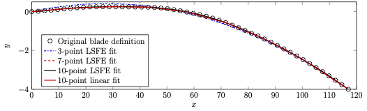
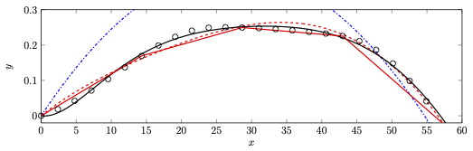

.. _sec-lsfit:

Beam reference lines and reference configuration
^^^^^^^^^^^^^^^^^^^^^^^^^^^^^^^^^^^^^^^^^^^^^^^^

The use of LSFEs as our beam spatial discretization presents
opportunities and challenges for the geometric representation of slender
structures like turbine blades. Turbine blades can be curved, swept,
and/or twisted along their length. In this section we describe how beams
are user defined and how the beams are discretized in the reference
configuration.

We assume that OpenTurbine beams are defined as a set of points in the
global coordinate system (
:math:`(\overline{x}^\mathrm{g}, \overline{y}^\mathrm{g},\overline{z}^\mathrm{g})`
with the blade root located at the origin and oriented such that the
pitch axis, or its primary-length direction, is pointing in the
:math:`x` direction. For turbine blades, the :math:`y` direction is the
direction of the trailing edge and defines a zero pitch/twist. Note that
this differs from the standard turbine-blade definition, which can be
easily rotated into our system.

The user must provide :math:`n^\mathrm{geom} \ge 2` points defining the
reference line with the data
:math:`(\eta_i^\mathrm{geom},\underline{x}_i^\mathrm{geom},\tau_i^\mathrm{geom})`,
:math:`i \in \{ 1, 2, \ldots, n^\mathrm{geom}\}`, where
:math:`\eta_i^\mathrm{geom}\in[0,1]` defines the nondimensional position
along the beam reference line where the associated reference line
position is :math:`\underline{x}_i^\mathrm{geom} \in \mathbb{R}^3` and
twist about the reference line is :math:`\tau_i^\mathrm{geom}`. The user
must also provide the :math:`n^Q` quadrature locations
:math:`\xi_k^Q \in [-1,1]` along the reference axis. Finally, the user
must provide the translation and rotation,
:math:`\underline{u}^\mathrm{init}` and
:math:`\underline{\underline{R}}^\mathrm{init}`, respectively, of the
beam that defines the initial/reference position and orientation. In other
words, each beam is defined in the global system with its root at the
origin and it is then translated and rotated into its reference
position.

Our approach is to represent the geometry with a single spectral element
with relatively few points, which we describe here. Given
:math:`n^\mathrm{geom}` points describing the beam as above, we wish to
represent that beam with a :math:`P`-point Legendre spectral finite
element, where :math:`P` is a user input. We first perform a
least-squares fit to the data using a LSFE polynomial with
:math:`\mathrm{min}(P,n^\mathrm{geom})` points, where the endpoints of
the fitting polynomial are constrained to coincide with the reference
data at :math:`\eta_1^\mathrm{geom}` and
:math:`\eta^\mathrm{geom}_{n^\mathrm{geom}}`. If
:math:`P \le n^\mathrm{geom}`, that fit defines the :math:`P` nodal
locations of the LSFE. If :math:`P > n^\mathrm{geom}`, then a new
LSFE is constructed with :math:`P`-nodes that lie on the lower-order
:math:`n^\mathrm{geom}`-point least-squares fit. The result are nodal
values :math:`\underline{x}^\mathrm{fit}_\ell \in \mathbb{R}^3`, for
:math:`\ell \in \{1, \ldots, P\}`. The geometry of the reference line
(in the local coordinate system) is given (in the element natural
coordinates) as

.. math::

   \begin{aligned}
    \underline{x}^\mathrm{geom}(\xi) = \sum_{\ell=1}^P \underline{x}^\mathrm{fit}_\ell \phi_\ell(\xi)
   \end{aligned}

for :math:`\xi\in[-1,1]`.

Figure :numref:`fig-lsfit-example` shows the results of the fitting
process for the IEA 15-MW reference turbine, which is defined by 50
points. Shown are LSFE fits with 3, 7, and 10 nodes. Clearly the 10-node
fit provides an excellent geometric approximation of the discrete data.
For reference, also shown is 10-node representation with linear
segments, which emphasizes the advantage of the LSFE representation for
a given number of nodes.

.. _fig-lsfit-example:

   Discrete representation of the IEA 15-MW reference-turbine blade reference line with 50 points, and four continuous-function representations of the beam reference line.

   Close up of the data shown in Figure :numref:`fig-lsfit-example`.

A beam’s reference line also requires the definition of its orientation.
We construct the orientation from the LSFE line as follows:

#. Calculate the unit tangent at each LSFE node:

   .. math::

      \begin{aligned}
       \overline{t}^{\mathrm{fit}}_i = 
      \sum_{\ell=1}^P \underline{x}^\mathrm{fit}_\ell 
      \left .  \frac{\partial \phi_\ell}{\partial \xi}\right|_{\xi=\xi_i} / 
      \left \Vert\sum_{i=1}^P \underline{x}^\mathrm{fit}_i 
      \left .  \frac{\partial \phi_i}{\partial \xi}\right|_{\xi=\xi_i}  
      \right\Vert 
      , \quad \forall i \in \{1, \ldots, P\}
      \end{aligned}

#. At each LSFE node, calculate a unit vector,
   :math:`\overline{n}^\mathrm{fit}_i`, normal to
   :math:`\overline{t}^\mathrm{fit}_i` with the additional requirement
   that it lies in the local
   :math:`\overline{x}^\mathrm{g}-\overline{y}^\mathrm{g}` plane, i.e.,
   :math:`\overline{n}^\mathrm{fit}_i = (n_1^\mathrm{fit},n_2^\mathrm{fit}, 0 )`
   with the requirements
   :math:`\left|\overline{n}^\mathrm{fit}_i \right | = 1` and
   :math:`\overline{n}^\mathrm{fit}_i \cdot \overline{t}^\mathrm{fit}_i = 0`.

#. The binormal vector is then given by
   :math:`\underline{b}^\mathrm{fit}_i = \widetilde{t^\mathrm{fit}_i} \underline{n}^\mathrm{fit}_i`.

#. The orientation at node :math:`i` is given by

   .. math::

      \begin{aligned}
      \underline{\underline{R}}^\mathrm{fit}_i = 
      \begin{bmatrix}
      \overline{t}^\mathrm{fit}_i \,\,
      \overline{n}^\mathrm{fit}_i \,\,
      \overline{b}^\mathrm{fit}_i
      \end{bmatrix}
      ,\, \forall i \in \{1, \ldots, P\}
      \end{aligned}

   which have the associated quaternions
   :math:`\widehat{q}_i^\mathrm{fit}`.

#. Nodal positions in the reference position, given
   :math:`\underline{u}^\mathrm{init}` and
   :math:`\underline{\underline{R}}^\mathrm{init}`, are calculated as

   .. math::

      \begin{aligned}
      \underline{x}^0_i = \underline{x}^\mathrm{fit}_i + \underline{u}^\mathrm{init} + \underline{\underline{R}}^\mathrm{init}\underline{x}^\mathrm{fit}_i,\quad \forall i \in  \{1,  \ldots, P \}
      \end{aligned}

#. Nodal orientations are calculated as

   .. math::

      \begin{aligned}
      \underline{\underline{R}}^0_i = \underline{\underline{R}}^\mathrm{init} \underline{\underline{R}}\left(\overline{t}_i^\mathrm{fit},\tau^\mathrm{geom} \right) \underline{R}^\mathrm{fit}_i
      ,\quad \forall i \in  \{1,  \ldots, P \}
      \end{aligned}

   where
   :math:`\underline{\underline{R}}\left(\overline{t}_i^\mathrm{fit},-\tau^\mathrm{geom} \right)`
   denotes a rotation of :math:`-\tau^\mathrm{geom}` about the vector
   :math:`\overline{t}_i^\mathrm{fit}`, where :math:`\tau^\mathrm{geom}`
   is linearly interpolated from user-defined twist at nearest neighbors
   to :math:`\xi_i`.

#. We also require the reference orientations at quadrature points,
   :math:`\xi^\mathrm{Q}_k`, which are calculated as

   .. math::

      \begin{aligned}
      \underline{\underline{R}}^{0,\mathrm{Q}}_k = \underline{\underline{R}}^\mathrm{init} \underline{\underline{R}}\left(\overline{t}_k^\mathrm{Q},-\tau^\mathrm{geom,Q} \right) \underline{\underline{R}}\left(\widehat{q}^\mathrm{fit,Q}_k\right)
      ,\quad \forall k \in  \{1,  \ldots, n^\mathrm{Q} \}
      \end{aligned}

   where

   .. math::

      \begin{aligned}
       \overline{t}^{\mathrm{Q}}_k = 
      \sum_{\ell=1}^P \underline{x}^\mathrm{fit}_\ell 
      \left .  \frac{\partial \phi_\ell}{\partial \xi}\right|_{\xi=\xi_k^\mathrm{Q}} / 
      \left \Vert\sum_{\ell=1}^P \underline{x}^\mathrm{fit}_\ell 
      \left .  \frac{\partial \phi_\ell}{\partial \xi}\right|_{\xi=\xi_k^\mathrm{Q}}  
      \right\Vert 
      , \quad \forall k \in \{1, \ldots, n^\mathrm{Q}\}
      \end{aligned}

   .. math::

      \begin{aligned}
      \widehat{q}^{\mathrm{fit,Q}}_k = 
      \sum_{\ell=1}^P \widehat{q}^\mathrm{fit}_\ell 
       \phi_\ell\left(\xi_k^\mathrm{Q}\right) / 
      \left \Vert\sum_{\ell=1}^P \widehat{q}^\mathrm{fit}_\ell 
       \phi_\ell\left(\xi_k^\mathrm{Q} \right) 
      \right \Vert
      , \quad \forall k \in \{1, \ldots, n^\mathrm{Q}\}
      \end{aligned}

   and :math:`\tau^\mathrm{geom,Q}` is the twist at
   :math:`\xi_k^\mathrm{Q}` linearly interpolated from nearest
   neighbors.

